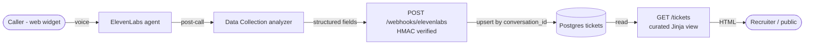

# Customer Support Triage Voice Agent

[](https://github.com/bradflavel/elevenlabs-support-triage/actions/workflows/ci.yml)

A deployable voice-agent demo for customer-support triage. An ElevenLabs Conversational AI agent handles inbound web-widget calls, routes across five support intents (billing, technical, account change, cancellation, other), and uses the platform's built-in Data Collection analysis to extract structured fields. A post-call webhook fires to a FastAPI backend which verifies the HMAC signature, persists a ticket row to Postgres (idempotent upsert), and exposes a public read-only `/tickets` dashboard showing privacy-safe curated fields.

> **Try it:** Live demo at <!-- RAILWAY_URL_PLACEHOLDER -->. Call the agent via the embedded widget and your ticket will appear on the public dashboard within seconds of the call ending.

## Architecture



End-to-end flow:

1. Caller clicks the browser widget, speaks with the agent. The agent follows the Phase 2 prompt in [docs/agent-prompts.md](docs/agent-prompts.md) to identify the intent and collect the key details.
2. When the call ends, ElevenLabs runs the Data Collection analyzer against the transcript and fires a post-call webhook to our FastAPI service.
3. The handler verifies the HMAC signature via the ElevenLabs SDK's `construct_event`, validates the transport-level fields with Pydantic (`extra="allow"`), and derives `intent` and `extraction_status` from the analyzer output.
4. The handler upserts the ticket row by `conversation_id` - retries are safe. The row carries normalized columns (for the dashboard) plus two JSONB columns (full `extracted_data` and `raw_payload`) for resilience against payload evolution.
5. The `/tickets` dashboard reads the normalized columns only - transcripts and raw payloads are never rendered.

## Tech stack

- Python 3.11+
- [FastAPI](https://fastapi.tiangolo.com/) - web framework
- [SQLAlchemy 2.0](https://www.sqlalchemy.org/) + [psycopg 3](https://www.psycopg.org/psycopg3/) - Postgres client
- [Pydantic](https://docs.pydantic.dev/) + `pydantic-settings` - payload validation + env loading
- [Jinja2](https://jinja.palletsprojects.com/) - dashboard templating
- [elevenlabs](https://pypi.org/project/elevenlabs/) SDK (pinned at **2.43.0**) - HMAC webhook verification via `construct_event`
- [uv](https://docs.astral.sh/uv/) - package and environment management
- [Railway](https://railway.app/) - hosting (native Python build via nixpacks, no Dockerfile)
- [ngrok](https://ngrok.com/) - local webhook tunnelling during development

## Tech choices - why this, not that

| Decision | Alternative considered | Why |
| --- | --- | --- |
| **Postgres, not SQLite** | SQLite | Railway volume ephemerality means disk is not durable. Postgres is the only safe option on this platform. Also, JSONB for `extracted_data` and `raw_payload`. |
| **Postgres, not Airtable** | Airtable | Real-time upsert semantics and HMAC-signed ingest are cleaner with a proper DB. Airtable adds rate limits, auth indirection, and schema fragility. |
| **Post-call webhook, not server tools** | Mid-call server tools | Server tools would be the wrong abstraction - this is an after-the-fact ingest of a finished conversation's structured analysis, not a mid-call API lookup. |
| **Jinja2, not React** | React / SPA | Dashboard is read-only, five columns, no interactive state. Jinja renders in one request with zero JS; shipping a React app would triple the build surface for no user-visible benefit. |
| **JSONB + normalized columns, not pure relational** | Columns only | The ElevenLabs payload shape can evolve. Normalized columns power the dashboard and filters; JSONB guarantees we never lose a field that changed upstream, and `raw_payload` is the debugging escape hatch. |
| **Platform enums + backend re-validation, not backend-only** | Enforce enums only in backend | Declaring enum values in the ElevenLabs Data Collection config constrains the analyzer at generation time. Backend Pydantic validation then acts as belt-and-braces. Live testing confirmed the platform returns `null` (not a forced pick) when no enum value fits, so backend logic treats null as `partial` rather than a bad value. |
| **Split LLMs: Haiku 4.5 for conversation, Sonnet 4.6 for analysis** | One model for both | The agent LLM runs in real-time during the call; latency matters more than marginal accuracy gains, so Haiku 4.5 (~790ms) is the right trade-off. The analysis model runs offline post-call where latency is irrelevant and extraction accuracy is everything, so Sonnet 4.6 earns the cost. This split mirrors how a production system would balance real-time constraints against accuracy. |
| **SDK `construct_event`, not hand-rolled HMAC** | `hmac.compare_digest` | SDK is the reference implementation for this version of the webhook format (timestamp tolerance + `v0=` signature scheme). Less crypto code to audit and maintain. |
| **`create_all` on startup, not Alembic** | Alembic migrations | Single-model demo. Alembic is correct for anything real; here it would be ceremony without payoff. Flagged explicitly in `PLAN.md` so the choice is visible. |
| **uv, not pip/poetry** | pip + requirements.txt; Poetry | Fast resolver, single lockfile, works out of the box with Railway's nixpacks Python provider. |
| **No auth on the dashboard** | Basic auth / magic link | Public by design - this is a demo. Privacy is enforced by **not rendering** the sensitive data in the first place: curated columns only, PII sanitizer on `summary`, `raw_payload` and `extracted_data` never touch the template. |

## Privacy

The public `/tickets` dashboard only renders `created_at`, `intent`, `extraction_status`, and `summary`. `conversation_id`, `extracted_data`, `raw_payload`, and the platform's built-in per-conversation summary are never surfaced by any route.

`summary` is passed through a sanitizer before persistence that redacts emails, phone numbers, and long numeric tokens (6+ digits). If redaction would leave an empty string, a neutral placeholder (`"Caller described a support issue; details withheld for privacy."`) is used instead.

The agent system prompt in [docs/agent-prompts.md](docs/agent-prompts.md) instructs the agent to avoid soliciting full credit card numbers, passwords, bank details, and names in the spoken summary. The backend sanitizer is the last line of defense; agent instructions are not sufficient on their own.

### Voice-channel limitations

Voice-to-text introduces a category of failure that text input doesn't. Callers naturally say "at" and "dot" when spelling email addresses, and STT transcribes these as literal words rather than `@` and `.`. Live testing captured `"test at symbol email.com"` as an `account_identifier` rather than `test@email.com`.

This is why the privacy architecture matters: `account_identifier` is captured but **not rendered on the public dashboard**. Even if STT produces a mangled or partially-captured identifier, it stays in the database and never reaches the template. Production systems handling real PII via voice should use a secondary channel (SMS verification, post-call email confirmation) for structured identifiers rather than relying on STT alone.

## Local development

See [RUNBOOK.md](RUNBOOK.md) for the full linear checklist. Fast path:

```bash
# Install uv first: https://docs.astral.sh/uv/getting-started/installation/
git clone <this-repo>
cd elevenagents-support-triage
cp .env.example .env
# Fill .env with DATABASE_URL and ELEVENLABS_WEBHOOK_SECRET
uv sync
uv run uvicorn app.main:app --reload
# In another terminal:
ngrok http 8000
# Paste the ngrok URL into the ElevenLabs agent's post-call webhook config.
```

## Running tests

```bash
uv run pytest -v
```

Test coverage (current count visible in CI badge output):

- Signature rejection (missing / bad) -> 401
- Malformed JSON with valid signature -> 400
- Missing transport-level required fields -> 422
- Idempotent replay (two identical POSTs = one row)
- All four extraction-status derivation paths (complete / partial / needs_review / intent-outside-enum)
- Value-unwrapping for Data Collection objects that arrive as `{value: X, rationale: "..."}`
- Summary sanitizer: emails, phone numbers, account-number-like tokens (unit + end-to-end)
- Dashboard: empty state, render with row, redirect, privacy regression (no `conversation_id` or debug fields leak into HTML), `needs_review` visual flag, intent filter (asserts filtered content, not just UI state)

Integration tests use a per-test transactional rollback fixture so nothing persists across runs.

## Test matrix

Extraction behaviour was validated against 10-12 synthetic calls spanning the five intents plus adversarial cases (vague input, out-of-scope topics, optional-field refusals, multi-intent ambiguity, voice-vs-text parity). Each scenario records the caller input, the agent's response shape, and the full Data Collection extraction output with derived `extraction_status`.

<!-- TEST_MATRIX_PLACEHOLDER - filled after Phase 2 calls are made -->

See [tests/test_matrix.md](tests/test_matrix.md) for the full list of scenarios and their extracted outputs.

### Observations from live extraction testing

Four findings surfaced during Phase 1 scenario runs that shaped the final design:

1. **Platform-level enums return `null`, not a forced pick, when no value fits.** An out-of-scope call (caller describing a login issue on a billing-only line) produced `intent: other` with `billing_issue_type: null`, correctly acknowledging that no billing category applied. Backend logic treats null required fields as `partial`, not as a classification.
2. **The analyzer respects "leave empty" instructions on optional numeric fields.** A deliberately vague call ("my bill just looks weird, I didn't look closely") produced `amount_disputed: null` - the model declined to invent a number. Strong anti-hallucination behaviour driven entirely by the field description.
3. **Optional-field refusals are cleanly captured as null.** A caller who declined to share an account identifier produced `account_identifier: null`, with all other fields extracting normally. The agent did not press after a single refusal, per prompt instructions.
4. **Voice captures spoken email addresses literally.** A voice call produced `account_identifier: "test at symbol email.com"` rather than `test@email.com`. See the voice-channel limitations note above.

## Failure modes considered

| Failure | Response |
| --- | --- |
| Bad HMAC signature | 401, no DB write. |
| Missing `elevenlabs-signature` header | 401. |
| Stale signature timestamp (>30 min old) | 401 via SDK `BadRequestError`. |
| Signed but non-JSON body | 400. |
| Missing `conversation_id` or `agent_id` | 422, no DB write. Caller should never retry this. |
| Unknown Data Collection field appears | Tolerated (`extra="allow"`), persisted in `extracted_data` JSONB. |
| Analyzer returns `null` for intent (no enum value fits) | Row persisted, `intent = null`, `extraction_status = partial`. Observed in out-of-scope test scenario. |
| Analyzer returns intent outside our enum (defensive path) | Row persisted, `intent = null`, `extraction_status = partial`. Platform-level enum enforcement makes this path unlikely; backend re-validation is belt-and-braces. |
| Analyzer flags ambiguity / multi-intent | Row persisted with `intent = needs_review`, `extraction_status = needs_review`. |
| Caller provides email by voice | STT transcribes as natural-language ("test at email dot com") rather than `test@email.com`. Captured in `account_identifier` which is never rendered publicly; downstream systems needing email format should verify via SMS/email rather than STT. |
| Summary contains PII | Redacted before persistence; placeholder used if fully redacted. |
| DB unreachable | 500. ElevenLabs retries on non-200; upsert by `conversation_id` makes retry safe. |
| Webhook delivered twice (retry or duplicate) | Idempotent: `INSERT ... ON CONFLICT DO UPDATE` keyed on `conversation_id`. |
| Railway volume reset | Filesystem is ephemeral; all durable state lives in Postgres. |

## Project structure

```
elevenagents-support-triage/
  Procfile                  # Railway web process
  railway.toml              # Railway build + deploy config
  pyproject.toml + uv.lock  # uv-managed deps
  .env.example              # env var inventory
  .github/workflows/ci.yml  # pytest against a Postgres service
  PLAN.md                   # design rationale
  RUNBOOK.md                # linear operator checklist
  docs/
    agent-prompts.md        # Phase 1 + Phase 2 system prompts
    data-collection-schema.md  # Data Collection field spec
    ticket-schema.md        # DB schema doc
  app/
    main.py                 # FastAPI app + lifespan create_all
    config.py               # pydantic-settings
    db.py                   # SQLAlchemy engine, session, URL normalizer
    models.py               # Ticket model + enums
    schemas.py              # Pydantic payload models
    webhook.py              # HMAC verify + upsert + sanitizer
    dashboard.py            # /tickets Jinja view
    templates/
      _base.html
      tickets.html
  tests/
    conftest.py             # DB fixture + signature helper
    test_webhook.py
    test_dashboard.py
    test_matrix.md          # scenario documentation
```

## Limitations and what v2 would add

- **Real phone numbers via Twilio / ElevenLabs phone**: the demo uses the browser widget only. A production deployment would route PSTN calls into the same agent.
- **Retry/backoff metrics**: right now we just rely on ElevenLabs' retry policy. A real system would track delivery attempts per `conversation_id` and alarm on persistent failures.
- **Alembic migrations**: single-model schema is fine for a demo. Adding a second model without Alembic would be the trigger to introduce it.
- **Authenticated admin view**: a companion route behind auth for ops staff to view `extracted_data`, `raw_payload`, and transcript excerpts for rows flagged `needs_review`. The public dashboard would remain curated-only.
- **Structured logging + tracing**: request IDs, correlation with `conversation_id`, export to an APM. Current setup is stdlib `logging` only.
- **Dashboard search and pagination**: the current view is capped at 200 rows, unpaginated. Trivial to extend once the volume warrants it.
- **Agent prompt A/B**: multiple prompt variants keyed off a feature flag, with the test matrix re-run against each.
- **Email/identifier verification channel**: when voice callers provide an email, surface a post-call SMS or email confirmation rather than relying on STT to capture the identifier correctly.

## Documents

- [PLAN.md](PLAN.md) - design decisions and architecture rationale
- [RUNBOOK.md](RUNBOOK.md) - step-by-step operator setup
- [docs/agent-prompts.md](docs/agent-prompts.md) - the agent's system prompts
- [docs/data-collection-schema.md](docs/data-collection-schema.md) - extraction field spec
- [docs/ticket-schema.md](docs/ticket-schema.md) - database schema doc

## Loom walkthrough

A 3-5 minute walkthrough recorded against the deployed service: a live call from the browser widget, the ticket appearing on the public `/tickets` dashboard within seconds, and a brief tour of the webhook handler's HMAC verification, idempotent upsert, and PII sanitizer.

<!-- LOOM_URL_PLACEHOLDER - populated after recording -->

---

Built across several focused sessions, each structured around a single deliverable - spec, implementation, audit, live extraction testing. Architecture, design decisions, agent prompts, Data Collection schema, and the test matrix are my work; Claude was used heavily for implementation velocity under direction. Every design trade-off in this README was defended before code was written. See the commit log for the build sequence.